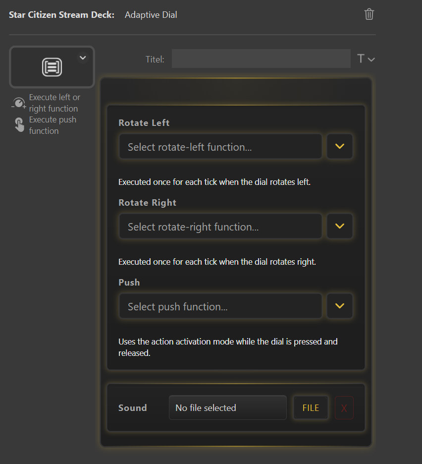
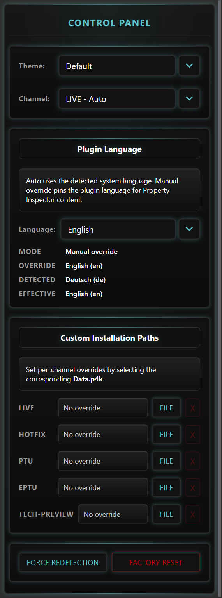

# Usage

## Adaptive Key

Use `Adaptive Key` for bindings you want to trigger in Star Citizen.
This is the most common key type you will use.

Basic flow:

1. Drag `Adaptive Key` onto a Stream Deck key.
2. Click on it to open the Property Inspector.
3. Select the Star Citizen function you want.
4. (Optional) Select a sound file (.wav/.mp3) from your system.

{ style="width:50%; height:auto;" }

## Adaptive Dial *(Stream Deck+)*

Use `Adaptive Dial` on a **Stream Deck+** device to map Star Citizen functions to the physical dial.

Each dial slot is independent:

| Slot | Trigger | Behaviour |
|---|---|---|
| **Rotate Left** | Turn dial counter-clockwise | Executes the assigned function once per tick |
| **Rotate Right** | Turn dial clockwise | Executes the assigned function once per tick |
| **Push** | Press the dial down / release | Executes the assigned function using its activation mode (e.g., Tap vs Hold) |

Basic flow:

1. Drag `Adaptive Dial` onto a dial slot on your Stream Deck+.
2. Click on it to open the Property Inspector.
3. Select a Star Citizen function for each slot you want to use (slots left empty are ignored).
4. (Optional) Select a sound file (.wav/.mp3) to play on dial press.

{ style="width:50%; height:auto;" }

!!! tip "Rotation step size"
    Each physical tick of the dial fires the function exactly once, so fast spins will queue multiple executions automatically.

## Toggle Key

Use `Toggle Key` for bindings that have two states (e.g., landing gear up/down).
You can also set a Reset threshold to resync the key state if it gets out of sync with the game.
While you can use all functions with Toggle Keys, they are best suited for functions that have a clear On/Off state.

Basic flow:

1. Drag `Toggle Key` onto a Stream Deck button.
2. Click on it to open the Property Inspector.
3. Select the Star Citizen function you want.
4. (Optional) Set a Reset threshold (from 0.2 to 10 seconds, default is 1). This defines how long you need to hold the key to reset its state (On → Off or Off → On).
5. (Optional) Select a Sound file (.wav/.mp3) from your system.

{ style="width:50%; height:auto;" }

## Control Panel Key

Use `Control Panel` for global plugin settings:

- Theme
- Channel (`LIVE`, `HOTFIX`, `PTU`, `EPTU`)
- Custom installation paths (if auto-detection fails)
- Force Redetection
- Factory reset

{ style="width:50%; height:auto;" }

!!! note "What Force Redetection & Factory Reset do"
    - **Force Redetection**: Re-runs the auto-detection of your Star Citizen installation path and keybindings. Use this if you moved your installation or changed keybindings in-game.
    - **Factory Reset**: Clears cached installs, your current theme, and custom overrides, then rebuilds keybindings.
